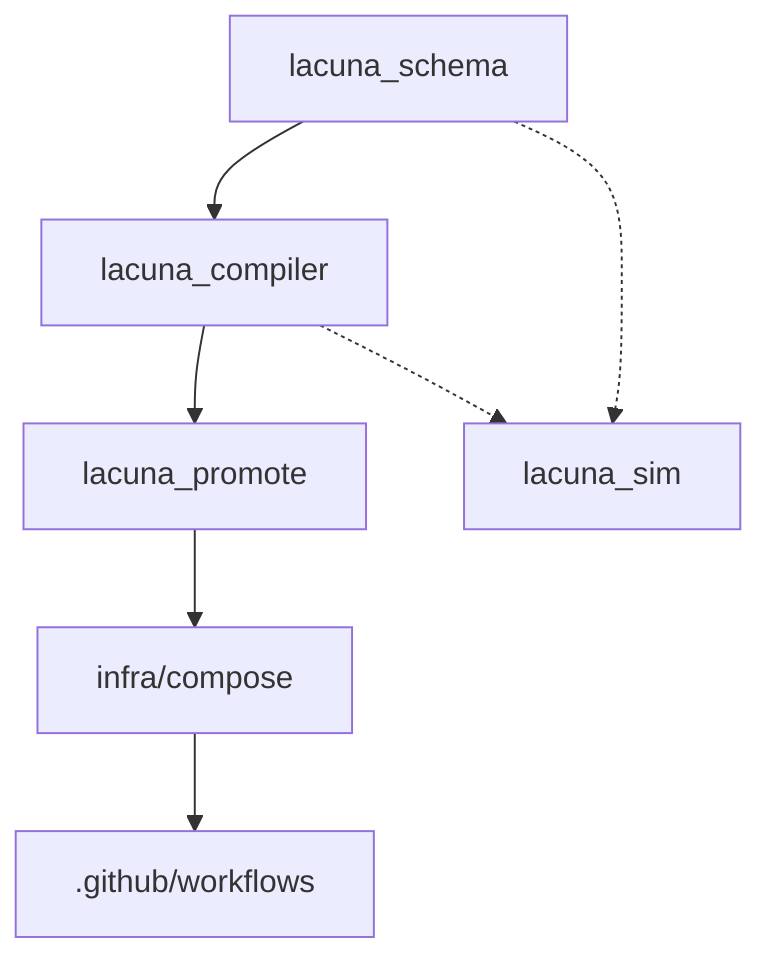

# Lacuna v2 - Project Structure & Parallel Development Guide

## Overview

Lacuna v2 is a KISS (Keep It Simple, Stupid) redirection service that uses **Caddy** at the edge with static rules compiled from **YAML → Caddy JSON** using a small **Python** toolchain.

**Current Status**: Documentation phase - no code implemented yet.

## Technology Stack

- **Python**: 3.13 (3.12 compatible)
- **Dependency Manager**: uv (with workspace support)
- **Type Checking**: mypy --strict
- **Linting/Formatting**: ruff, black
- **Data Modeling**: Pydantic v2
- **CLI Framework**: Typer or argparse
- **Testing**: pytest (target coverage ≥85%)
- **Containers**: Podman/Docker
- **Edge Server**: Caddy v2.8.x (JSON config)

---

## Target Repository Structure

```
Lacuna-ng/
├── packages/                           # Python packages (uv workspace)
│   ├── lacuna_schema/                  # Sub-project 1: YAML validation
│   │   ├── pyproject.toml
│   │   ├── src/
│   │   │   └── lacuna_schema/
│   │   │       ├── __init__.py
│   │   │       ├── models.py           # Pydantic models
│   │   │       ├── validators.py       # Semantic validators
│   │   │       ├── api.py              # Public API
│   │   │       └── __main__.py         # CLI: python -m lacuna_schema.check
│   │   ├── tests/
│   │   │   ├── test_models.py
│   │   │   ├── test_validators.py
│   │   │   ├── fixtures/               # Good/bad YAML samples
│   │   │   └── test_properties.py      # Hypothesis tests
│   │   └── README.md
│   │
│   ├── lacuna_compiler/                # Sub-project 2: YAML → Caddy JSON
│   │   ├── pyproject.toml
│   │   ├── src/
│   │   │   └── lacuna_compiler/
│   │   │       ├── __init__.py
│   │   │       ├── compiler.py         # Core compilation logic
│   │   │       ├── api.py              # Public API
│   │   │       └── cli.py              # CLI: lacuna-compiler
│   │   ├── tests/
│   │   │   ├── test_compiler.py
│   │   │   ├── test_golden.py          # Golden file tests
│   │   │   └── golden/                 # Expected JSON outputs
│   │   └── README.md
│   │
│   └── lacuna_promote/                 # Sub-project 3: Double-buffer promotion
│       ├── pyproject.toml
│       ├── src/
│       │   └── lacuna_promote/
│       │       ├── __init__.py
│       │       ├── promoter.py         # Promotion logic
│       │       ├── api.py              # Public API
│       │       └── cli.py              # CLI wrapper
│       ├── tests/
│       │   ├── test_promoter.py
│       │   └── test_rollback.py        # Chaos/failure tests
│       └── README.md
│
├── tools/                              # Optional development tools
│   └── lacuna_sim/                     # Sub-project 4: Dry-run simulator
│       ├── pyproject.toml
│       ├── src/
│       │   └── lacuna_sim/
│       │       ├── __init__.py
│       │       ├── simulator.py        # Route evaluation
│       │       └── cli.py              # CLI: lacuna-sim
│       ├── tests/
│       │   └── test_simulator.py
│       └── README.md
│
├── infra/                              # Infrastructure configs
│   ├── Dockerfile.caddy                # Caddy container image
│   ├── compose.yaml                    # Docker Compose for local dev
│   └── k8s/                            # Kubernetes manifests
│       ├── deployment.yaml
│       ├── service.yaml
│       └── pvc.yaml
│
├── examples/                           # Sample configurations
│   ├── domainlist.yaml                 # Minimal sample
│   └── cases.txt                       # Test cases for simulator
│
├── vol/                                # Local dev volumes (gitignored)
│   ├── config/                         # Config buffer directory
│   │   ├── config.next.json
│   │   ├── config.active.json
│   │   └── config.lastgood.json
│   └── caddy/                          # Caddy data (ACME cache)
│
├── .github/
│   └── workflows/
│       └── ci.yaml                     # CI/CD pipeline
│
├── pyproject.toml                      # Root workspace config (uv)
├── .pre-commit-config.yaml             # Pre-commit hooks
├── .gitignore
├── Makefile                            # Dev convenience targets
├── AGENTS.md                           # Agent instructions (existing)
├── todo.md                             # Legacy todo (existing)
└── PROJECT_STRUCTURE.md                # This file
```

---

## Pyproject Files Structure

### 1. Root `pyproject.toml` (Workspace)

Location: `/Lacuna-ng/pyproject.toml`

```toml
[project]
name = "lacuna"
version = "2.0.0-dev"
description = "KISS redirection service with Caddy"
requires-python = ">=3.12"
authors = [{ name = "Lacuna Team" }]

[tool.uv.workspace]
members = [
    "packages/lacuna_schema",
    "packages/lacuna_compiler",
    "packages/lacuna_promote",
    "tools/lacuna_sim"
]

[tool.uv]
dev-dependencies = [
    "pytest>=8.0.0",
    "pytest-cov>=4.1.0",
    "mypy>=1.11.0",
    "ruff>=0.7.0",
    "black>=24.0.0",
    "hypothesis>=6.0.0",
    "pre-commit>=3.0.0"
]

[tool.mypy]
strict = true
python_version = "3.12"

[tool.ruff]
target-version = "py312"
line-length = 100

[tool.black]
line-length = 100
target-version = ["py312"]

[tool.pytest.ini_options]
testpaths = ["packages/*/tests", "tools/*/tests"]
addopts = "-v --cov=packages --cov=tools --cov-report=term --cov-report=html"
```

### 2. Sub-project pyproject.toml Template

Each sub-project (`lacuna_schema`, `lacuna_compiler`, `lacuna_promote`, `lacuna_sim`) has its own:

```toml
[project]
name = "lacuna_<package>"
version = "2.0.0-dev"
description = "<package description>"
requires-python = ">=3.12"
dependencies = [
    # Package-specific deps
    # e.g., "pydantic>=2.0", "typer>=0.12.0"
]

[project.optional-dependencies]
dev = [
    "pytest>=8.0.0",
    "mypy>=1.11.0"
]

[build-system]
requires = ["hatchling"]
build-backend = "hatchling.build"

[tool.hatch.build.targets.wheel]
packages = ["src/<package_name>"]
```

---

## Sub-Projects & Dependencies

### Dependency Graph



### 1. `lacuna_schema` (Foundation)

**Dependencies**: `pydantic>=2.0`, `pyyaml>=6.0`, `typer>=0.12.0`

**Purpose**: Validate YAML configs into typed Pydantic models

**Key Deliverables**:
- Models: `Config`, `Host`, `Rule`, `Defaults`
- Validators: scheme allowlist, ID syntax, no templating chars
- Sorting: longest-path-first for exact/prefix rules
- CLI: `python -m lacuna_schema.check <yaml>`

**No external Lacuna dependencies** - can be developed in parallel

---

### 2. `lacuna_compiler` (Core Logic)

**Dependencies**: `lacuna_schema`, `typer>=0.12.0`

**Purpose**: Compile validated Config → deterministic Caddy JSON

**Key Deliverables**:
- Exact match handler: `static_response` with `Location`
- Prefix match handler: `subroute` with `rewrite` + redirect
- Header injection: `X-Lacuna-Rule: <id>`
- HSTS headers per host
- Metadata embedding: `_meta` block with build info
- CLI: `lacuna-compiler <yaml> --out-dir <dir> [--validate-only]`

**Depends on**: `lacuna_schema` (blocking dependency)

---

### 3. `lacuna_promote` (Operations)

**Dependencies**: `lacuna_compiler`, `lacuna_schema`

**Purpose**: Double-buffer config promotion with validation and rollback

**Key Deliverables**:
- Atomic writes: temp + fsync + os.replace
- Validation: `caddy validate --config <next>`
- Reload: `caddy reload --config <next>`
- Rollback: automatic on failure → restore `lastgood`
- Health probe: optional sentinel URL check
- CLI: integrated into `lacuna-compiler` CLI

**Depends on**: `lacuna_compiler` (blocking dependency)

---

### 4. `lacuna_sim` (Testing Tool - Optional)

**Dependencies**: `lacuna_schema`, optionally `lacuna_compiler`

**Purpose**: Simulate requests against config to find dead rules

**Key Deliverables**:
- Route evaluator: mirrors Caddy match logic (subset)
- Test case generator: from YAML rules
- Coverage report: which rules matched which requests
- Dead rule detection
- CLI: `lacuna-sim --json <config> --cases <txt>`

**Can develop in parallel** after schema is ready

---

### 5. `infra` (Deployment)

**Dependencies**: None (external)

**Purpose**: Container images, compose, k8s manifests

**Key Deliverables**:
- `Dockerfile.caddy`: based on `caddy:2.8`
- `compose.yaml`: ports 80/443, volumes for config + ACME
- `k8s/`: Deployment, Service, PVC manifests
- Volume layout: `/srv/lacuna/config/`, `/data/`

**Can develop in parallel** with all code packages

---

### 6. CI/CD Pipeline

**Dependencies**: All above

**Purpose**: Quality gates, testing, image building

**Key Deliverables**:
- `.pre-commit-config.yaml`: ruff, black, mypy, yamllint
- `.github/workflows/ci.yaml`: test → lint → validate → build → push
- Multi-arch image builds: amd64 + arm64
- GHCR publishing on main branch

**Develop after** core packages have basic structure

---

## Parallel Development Strategy

### Phase 1: Foundation (Parallel)

These can be developed **simultaneously** by different agents:

| Agent ID | Task | Dependencies | Blocking Others |
|----------|------|--------------|-----------------|
| **Agent-Schema** | Implement `lacuna_schema` | None | Compiler, Promote |
| **Agent-Infra** | Create `infra/` files | None | None |
| **Agent-Setup** | Create root configs (pyproject, pre-commit, gitignore, Makefile) | None | None |
| **Agent-Examples** | Create `examples/domainlist.yaml` | None | Testing |

**Coordination**: Agent-Schema should signal completion, then unblock Phase 2.

---

### Phase 2: Core Logic (Parallel after Schema)

**Prerequisite**: `lacuna_schema` complete

| Agent ID | Task | Dependencies | Blocking Others |
|----------|------|--------------|-----------------|
| **Agent-Compiler** | Implement `lacuna_compiler` | lacuna_schema | Promote |
| **Agent-Sim** | Implement `lacuna_sim` | lacuna_schema | None |

**Coordination**: Agent-Compiler signals completion → unblocks Phase 3.

---

### Phase 3: Operations (Sequential)

**Prerequisite**: `lacuna_compiler` complete

| Agent ID | Task | Dependencies |
|----------|------|--------------|
| **Agent-Promote** | Implement `lacuna_promote` | lacuna_compiler, lacuna_schema |

---

### Phase 4: Integration (Parallel)

**Prerequisite**: Core packages complete

| Agent ID | Task | Dependencies |
|----------|------|--------------|
| **Agent-CI** | Implement `.github/workflows/ci.yaml` | All packages |
| **Agent-Testing** | End-to-end integration tests | All packages, infra |
| **Agent-Docs** | Package READMEs + root README.md | All packages |

---

## Task Breakdown for Parallel Agents

### Agent-Schema Tasks (Priority 1)

1. Create `packages/lacuna_schema/pyproject.toml`
2. Implement Pydantic models: `Config`, `Defaults`, `Host`, `Rule`
3. Implement validators:
   - Scheme allowlist (http/https only)
   - Reject templating chars (`{`, `}`, `$`) in `to`
   - Rule ID syntax: `^[a-z0-9][a-z0-9._-]*$`
   - Duplicate ID detection per host
   - Status code validation (301/302/303/307/308)
4. Implement sorting helpers (longest-path-first)
5. CLI: `python -m lacuna_schema.check`
6. Unit tests: good/bad fixtures, property tests (Hypothesis)
7. Achieve mypy --strict compliance
8. README with API examples

**Exit Criteria**: All tests pass, `mypy --strict` clean, CLI validates sample YAML

---

### Agent-Infra Tasks (Priority 1 - Parallel)

1. Create `infra/Dockerfile.caddy`
   - Base: `caddy:2.8`
   - Config: `/srv/lacuna/config/config.active.json`
   - ACME cache: `/data`
2. Create `infra/compose.yaml`
   - Ports: 80:80, 443:443
   - Volumes: `./vol/config`, `./vol/caddy`
   - Admin API: bound to loopback
3. Create `infra/k8s/` manifests
   - `deployment.yaml`: Caddy pod
   - `service.yaml`: LoadBalancer or NodePort
   - `pvc.yaml`: Persistent volumes for config + ACME
4. Add health check probes

**Exit Criteria**: `docker compose up` runs successfully (may need placeholder config)

---

### Agent-Setup Tasks (Priority 1 - Parallel)

1. Create root `pyproject.toml` with uv workspace
2. Create `.pre-commit-config.yaml`:
   - ruff (check + format)
   - black
   - mypy
   - yamllint
3. Create `.gitignore`:
   - `vol/`
   - `__pycache__/`, `*.pyc`
   - `.pytest_cache/`, `.mypy_cache/`, `.ruff_cache/`
   - `.coverage`, `htmlcov/`
   - `*.egg-info/`, `dist/`, `build/`
4. Create `Makefile` with targets:
   - `fmt`: Run ruff + black
   - `lint`: Run mypy
   - `test`: Run pytest
   - `compile`: Run lacuna-compiler --validate-only
   - `promote`: Run lacuna-compiler (with reload)
   - `run`: docker compose up

**Exit Criteria**: `uv sync` works, pre-commit hooks install successfully

---

### Agent-Examples Tasks (Priority 1 - Parallel)

1. Create `examples/domainlist.yaml` (minimal valid config):
   - 2 hosts (prod + parked)
   - Mix of exact and prefix rules
   - Demonstrates HSTS on/off
   - Demonstrates keep_query
2. Create `examples/cases.txt` (test requests for simulator):
   - Format: `HOST PATH [QUERY]`
   - Cover all rules in domainlist.yaml

**Exit Criteria**: YAML parses successfully once schema validator is ready

---

### Agent-Compiler Tasks (Priority 2 - Blocked by Schema)

1. Create `packages/lacuna_compiler/pyproject.toml`
2. Implement `compile_to_caddy(cfg: Config) -> dict`:
   - HTTP→HTTPS redirect server on port 80
   - HTTPS server on port 443 with SNI routing
   - Exact match: `static_response` with `Location` header
   - Prefix match: `subroute` with `rewrite strip_path_prefix`
   - Query preservation: conditional `?{http.request.uri.query}`
   - Header injection: `X-Lacuna-Rule: <id>`
   - HSTS headers per host
3. Add `_meta` block: build timestamp, git hash, content SHA
4. Implement deterministic JSON (stable ordering, pretty-print)
5. CLI: `lacuna-compiler <yaml> --out-dir <dir> [--validate-only|--promote]`
6. Golden file tests: assert identical JSON across runs
7. Integration tests: verify `Location` headers
8. README with usage examples

**Exit Criteria**: Golden tests pass, integration tests probe URLs successfully

---

### Agent-Sim Tasks (Priority 2 - Blocked by Schema, Parallel with Compiler)

1. Create `tools/lacuna_sim/pyproject.toml`
2. Implement route evaluator:
   - Parse Caddy JSON or YAML
   - Match requests against rules (exact → prefix order)
   - Return: matched rule ID, status, location
3. Implement test case loader from `cases.txt`
4. Generate coverage report:
   - Which rules were matched
   - Dead rules (never matched)
5. CLI: `lacuna-sim --json <config> [--yaml <yaml>] --cases <txt>`
6. Unit tests: verify match logic
7. README with usage examples

**Exit Criteria**: Correctly identifies matches/misses, no false positives

---

### Agent-Promote Tasks (Priority 3 - Blocked by Compiler)

1. Create `packages/lacuna_promote/pyproject.toml`
2. Implement double-buffer logic:
   - Write `config.next.json` atomically (tmp + fsync + os.replace)
   - Run `caddy validate --config next`
   - Optional: probe sentinel URL(s)
   - Run `caddy reload --config next`
   - On success: promote `next` → `active`, backup `active` → `lastgood`
   - On failure: reload `lastgood`, exit non-zero
3. Integrate into `lacuna-compiler` CLI (default behavior unless `--validate-only`)
4. Chaos tests:
   - Corrupted JSON → validation fails → no promotion
   - Simulated reload failure → rollback to lastgood
5. Clear logging for all state transitions
6. README with rollback procedures

**Exit Criteria**: Rollback works under simulated failures, logs are clear

---

### Agent-CI Tasks (Priority 4 - Blocked by All Packages)

1. Create `.github/workflows/ci.yaml`:
   - Job `test`:
     - Install uv, sync deps
     - Run ruff, black --check, mypy
     - Run pytest with coverage
     - Validate example configs
   - Job `docker`:
     - Build multi-arch image (amd64, arm64)
     - Push to GHCR on main branch
     - Tag with git SHA + latest
2. Configure branch protection for main
3. Add status badges to README

**Exit Criteria**: CI passes on example PR, image builds successfully

---

### Agent-Testing Tasks (Priority 4 - Parallel with CI)

1. Create end-to-end integration test:
   - Compile example YAML
   - Start Caddy with compiled JSON
   - Probe URLs with `requests` or `curl`
   - Assert `Location` headers and status codes
2. Add to pytest suite: `tests/integration/test_e2e.py`
3. Optional: Add to CI workflow as separate job

**Exit Criteria**: E2E test passes locally and in CI

---

### Agent-Docs Tasks (Priority 4 - Parallel with CI)

1. Create root `README.md`:
   - Project overview
   - Quick start guide
   - Link to AGENTS.md for contributors
2. Ensure each package has `README.md`:
   - Package purpose
   - API usage examples
   - CLI usage examples
3. Add architecture diagram (Mermaid)

**Exit Criteria**: Documentation is clear and complete

---

## Development Workflow

### Local Development Loop

```bash
# 1. Install dependencies
uv sync --all-extras --dev

# 2. Install pre-commit hooks
pre-commit install

# 3. Develop (example: work on schema)
cd packages/lacuna_schema
# Edit code...

# 4. Run formatters
make fmt

# 5. Run type checks
make lint

# 6. Run tests
make test

# 7. Validate example config
uv run python -m lacuna_schema.check examples/domainlist.yaml

# 8. Compile to JSON (once compiler is ready)
make compile

# 9. Run Caddy locally
caddy run --config ./vol/config/config.next.json

# 10. Promote config (once promote is ready)
make promote

# 11. Run full stack
make run
```

---

## Security Checklist

- [ ] Only `http` and `https` schemes allowed
- [ ] No templating characters (`{`, `}`, `$`) in `to` field
- [ ] Rule IDs are alphanumeric with limited symbols
- [ ] Caddy admin API bound to loopback/internal network
- [ ] HSTS enabled for production hosts
- [ ] HSTS disabled for parked domains
- [ ] Double-buffered config with rollback
- [ ] Atomic file writes (fsync + os.replace)
- [ ] No user-driven redirects (no open redirect risk)

---

## Success Metrics (MVP Done Definition)

- [ ] All packages pass `mypy --strict`
- [ ] Test coverage ≥85% across all packages
- [ ] Example YAML validates and compiles successfully
- [ ] Exact and prefix redirects work correctly
- [ ] `X-Lacuna-Rule` header present on all redirects
- [ ] HSTS headers set correctly per policy
- [ ] Double-buffer promotion works with rollback
- [ ] `docker compose up` runs successfully
- [ ] CI pipeline green on all branches
- [ ] Multi-arch image published to GHCR
- [ ] End-to-end integration test passes

---

## Next Steps

1. **Assign agents to Phase 1 tasks** (can run in parallel):
   - Agent-Schema → `lacuna_schema` package
   - Agent-Infra → `infra/` directory
   - Agent-Setup → root configs
   - Agent-Examples → `examples/` directory

2. **Monitor Agent-Schema completion** → unblocks Phase 2

3. **Launch Phase 2 agents** (parallel):
   - Agent-Compiler → `lacuna_compiler` package
   - Agent-Sim → `lacuna_sim` tool

4. **Monitor Agent-Compiler completion** → unblocks Phase 3

5. **Launch Agent-Promote** → `lacuna_promote` package

6. **Launch Phase 4 agents** (parallel):
   - Agent-CI → GitHub Actions
   - Agent-Testing → E2E tests
   - Agent-Docs → Documentation

---

## References

- **AGENTS.md**: Detailed agent prompts and technical specs
- **todo.md**: Original project planning document
- **Caddy docs**: https://caddyserver.com/docs/
- **Pydantic v2 docs**: https://docs.pydantic.dev/latest/
- **uv docs**: https://docs.astral.sh/uv/
