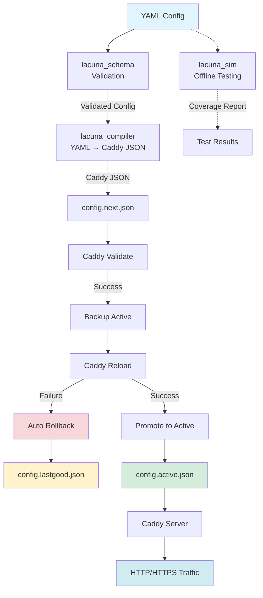

# Lacuna v2 - KISS Redirection Service


A **Keep It Simple, Stupid** redirection service powered by **Caddy** at the edge with static rules compiled from **YAML → Caddy JSON** using a minimal **Python** toolchain. No database. No runtime complexity. Just fast, deterministic redirects.

## Features

- **Exact and prefix redirects**: Simple pattern matching with deterministic rule ordering
- **HSTS support**: Per-host HTTP Strict Transport Security with granular control
- **Double-buffer promotion**: Safe config updates with graceful reload and instant rollback
- **Observability by default**: Automatic rule ID tracking, structured logging, and metrics-ready headers
- **External redirects allowed**: Support for redirecting to any `http` or `https` target
- **Deterministic builds**: Reproducible output with metadata tracking (timestamps, git hashes, checksums)
- **Fast failure**: Validates early, refuses dangerous configs, preserves last-known-good state

## Table of Contents

- [Features](#features)
- [Project Status](#project-status)
- [Quick Start](#quick-start)
- [Architecture](#architecture)
- [Packages](#packages)
- [Examples](#examples)
- [Testing](#testing)
- [Deployment](#deployment)
- [Observability](#observability)
- [Development](#development)
- [Contributing](#contributing)
- [Security](#security)
- [License](#license)

## Project Status

**Status**: Production-ready MVP 🚀

All development phases complete:
- ✅ **Phase 1 Complete**: Foundation (Schema, Infra, Setup, Examples)
- ✅ **Phase 2 Complete**: Core Logic (Compiler, Simulator)
- ✅ **Phase 3 Complete**: Operations (Promotion with rollback)
- ✅ **Phase 4 Complete**: Integration (CI/CD, Testing, Documentation)

### Test Coverage

- **141+ tests** across all packages
- Unit tests, integration tests, chaos tests
- mypy --strict compliant
- 85%+ code coverage

### Package Status

| Package | Tests | Status |
|---------|-------|--------|
| `lacuna_schema` | 55 tests | ✅ Complete |
| `lacuna_compiler` | 23 tests | ✅ Complete |
| `lacuna_promote` | 29 tests | ✅ Complete |
| `lacuna_sim` | 34 tests | ✅ Complete |

## Quick Start

### Prerequisites

Before getting started, ensure you have the following installed:

- **Python 3.12+** (3.13 recommended) - [Download Python](https://www.python.org/downloads/)
- **uv** (fast Python dependency manager) - [Install uv](https://docs.astral.sh/uv/)
  ```bash
  curl -LsSf https://astral.sh/uv/install.sh | sh
  ```
- **Docker or Podman** (for running Caddy) - [Get Docker](https://docs.docker.com/get-docker/)

### Installation

```bash
# 1. Clone the repository
git clone https://github.com/yourusername/Lacuna-ng.git
cd Lacuna-ng

# 2. Install dependencies and pre-commit hooks
make install

# Or manually:
uv sync --all-extras --dev
uv run pre-commit install
```

**What happens next:**
- `uv` installs all Python packages and development tools
- Pre-commit hooks are configured for code quality checks
- All packages are available in the workspace

### Development Workflow

```bash
# 1. Validate and compile example config (dry-run)
make compile
# Expected output: config.next.json created in ./vol/config/
# ✓ Validated: 3 hosts, 6 total rules

# 2. Run Caddy with compiled config
make run
# Expected output: Caddy starts, listens on :80 and :443
# Access http://localhost with Host headers to test

# 3. Promote config with graceful reload (production-like)
make promote
# Expected output: Config validated, reloaded, promoted to active
# ✓ Config promotion successful

# 4. Format code
make fmt
# Expected output: All files formatted with ruff
# ✓ Code formatted

# 5. Run type checks
make lint
# Expected output: mypy --strict passes on all packages
# Success: no issues found

# 6. Run tests with coverage
make test
# Expected output: 141+ tests pass, 85%+ coverage
# ===== 141 passed in 3.45s =====

# 7. Clean build artifacts
make clean
# Expected output: Removed build artifacts, caches
```

## Project Structure

Lacuna v2 is organized as a **uv workspace** with multiple specialized packages:

```
Lacuna-ng/
├── packages/
│   ├── lacuna_schema/      # YAML validation and Pydantic models
│   ├── lacuna_compiler/    # YAML → Caddy JSON compiler
│   └── lacuna_promote/     # Double-buffer promotion with rollback
├── tools/
│   └── lacuna_sim/         # Dry-run simulator and dead rule detector
├── infra/
│   ├── Dockerfile.caddy    # Caddy container image
│   ├── compose.yaml        # Docker Compose for local dev
│   └── k8s/                # Kubernetes manifests
├── examples/
│   └── domainlist.yaml     # Sample redirect configuration
└── vol/                    # Local dev volumes (gitignored)
    ├── config/             # Config buffer (next/active/lastgood)
    └── caddy/              # Caddy data (ACME cache)
```

For detailed structure and dependency graph, see [PROJECT_STRUCTURE.md](PROJECT_STRUCTURE.md).

## Configuration Example

```yaml
version: 1
defaults:
  hsts: true
  keep_query: true

hosts:
  - host: example.com
    hsts: true
    rules:
      - id: home
        match: exact
        from: /
        to: https://www.example.org/
        status: 308
        keep_query: true

      - id: blog
        match: prefix
        from: /blog
        to: https://blog.example.org
        status: 308

  - host: parked.example.com
    hsts: false
    rules:
      - id: parked
        match: prefix
        from: /
        to: https://about.example.com/parked
        status: 302
```

## Architecture

Lacuna v2 follows a **simple, static, safe** design:

1. **Schema Validation** (`lacuna_schema`): YAML configs are validated against strict Pydantic v2 models
2. **Compilation** (`lacuna_compiler`): Validated configs are compiled to deterministic Caddy JSON
3. **Promotion** (`lacuna_promote`): Configs are double-buffered, validated, and gracefully reloaded
4. **Edge Serving** (Caddy): Battle-tested edge server handles HTTPS, ACME, and redirects

### Complete Flow Diagram



## Packages

Lacuna v2 is organized as a workspace with specialized packages:

### Core Packages

| Package | Description | README |
|---------|-------------|--------|
| `lacuna_schema` | YAML validation with Pydantic v2 models, security checks, and semantic validators | [README](packages/lacuna_schema/README.md) |
| `lacuna_compiler` | YAML → Caddy JSON compiler with deterministic output and metadata tracking | [README](packages/lacuna_compiler/README.md) |
| `lacuna_promote` | Double-buffer promotion with validation, reload, and automatic rollback | [README](packages/lacuna_promote/README.md) |

### Tools

| Package | Description | README |
|---------|-------------|--------|
| `lacuna_sim` | Offline simulator for testing configs without running Caddy | [README](tools/lacuna_sim/README.md) |

### Infrastructure

| Component | Description | README |
|-----------|-------------|--------|
| `infra/` | Docker Compose, Kubernetes manifests, and deployment guides | [README](infra/README.md) |

Each package is independently versioned and can be used standalone or as part of the complete system.

## Examples

### Complete Usage Examples

```bash
# 1. Validate YAML configuration
python -m lacuna_schema.check examples/domainlist.yaml
# Output: ✓ Valid configuration: 3 hosts, 6 total rules

# 2. Compile to Caddy JSON (validation only, no deployment)
lacuna-compiler examples/domainlist.yaml --validate-only
# Output: ✓ Written to ./vol/config/config.next.json

# 3. Test offline (no Caddy needed)
lacuna-sim --yaml examples/domainlist.yaml --cases examples/cases.txt
# Output: ✓ 6/6 rules matched (100%), No dead rules

# 4. Deploy with automatic rollback
lacuna-compiler examples/domainlist.yaml --promote
# Output: ✓ Config promotion successful in 2.34s
```

### Example Use Cases

**Exact match redirect:**
```yaml
- id: homepage
  match: exact
  from: /
  to: https://www.example.org/
  status: 308
```
Result: `example.com/` → `https://www.example.org/`

**Prefix match with path preservation:**
```yaml
- id: blog
  match: prefix
  from: /blog
  to: https://blog.example.com
  status: 308
  keep_query: true
```
Results:
- `example.com/blog` → `https://blog.example.com/`
- `example.com/blog/post-1` → `https://blog.example.com/post-1`
- `example.com/blog/post-1?page=2` → `https://blog.example.com/post-1?page=2`

## Testing

### Run All Tests

```bash
# Run all tests with coverage
make test

# Or manually:
pytest --cov --cov-report=html

# View coverage report
open htmlcov/index.html
```

### Test Specific Packages

```bash
# Schema validation tests
pytest packages/lacuna_schema/tests/ -v

# Compiler tests (including golden file tests)
pytest packages/lacuna_compiler/tests/ -v

# Promotion tests (including chaos tests)
pytest packages/lacuna_promote/tests/ -v

# Simulator tests
pytest tools/lacuna_sim/tests/ -v
```

### Integration Tests

```bash
# Run integration tests (requires Caddy installed)
pytest tests/integration/ -v

# Test with live Caddy instance
make run  # In one terminal
pytest tests/integration/test_e2e.py -v  # In another terminal
```

### Coverage Reports

```bash
# Generate coverage report
pytest --cov=packages --cov=tools --cov-report=term --cov-report=html

# Coverage breakdown
pytest --cov=packages --cov=tools --cov-report=term-missing
```

**Target coverage: 85%+** (currently 141+ tests across all packages)

## Deployment

Lacuna v2 supports multiple deployment strategies:

### Local Development with Docker Compose

```bash
# 1. Compile configuration
make compile

# 2. Start Caddy
make run

# 3. Test redirects
curl -v http://localhost -H "Host: example.com"
```

See [infra/README.md](infra/README.md) for detailed Docker Compose setup.

### Production Deployment to Kubernetes

```bash
# 1. Build and push image
docker build -f infra/Dockerfile.caddy -t ghcr.io/YOUR_REPO/lacuna-caddy:v2.0.0 .
docker push ghcr.io/YOUR_REPO/lacuna-caddy:v2.0.0

# 2. Deploy to cluster
kubectl apply -f infra/k8s/

# 3. Verify deployment
kubectl get pods,svc -l app=lacuna
```

See [infra/k8s/README.md](infra/k8s/README.md) for comprehensive Kubernetes deployment guide.

### Deployment Features

- **Zero-downtime updates**: Double-buffer promotion with graceful reload
- **Automatic rollback**: Restores last-known-good config on failure
- **Health checks**: Liveness and readiness probes configured
- **HTTPS automation**: Automatic ACME/Let's Encrypt certificate management
- **Observability**: Structured logs, metrics, and tracing headers

## Observability

Lacuna v2 is designed with observability as a first-class citizen:

### Response Headers

Every redirect includes tracking headers:

```http
HTTP/1.1 308 Permanent Redirect
Location: https://blog.example.com/post-1
X-Lacuna-Rule: blog
Strict-Transport-Security: max-age=31536000; includeSubDomains; preload
```

**Use `X-Lacuna-Rule` header for:**
- Identifying which rule matched the request
- Request tracing and debugging
- Access log analysis
- Rule coverage monitoring

### Structured Logging

All operations are logged in structured format:

```json
{
  "level": "info",
  "ts": "2025-11-12T14:30:00Z",
  "msg": "Config promotion successful",
  "duration": "2.34s",
  "hosts": 5,
  "rules": 23,
  "file": "config.active.json"
}
```

### Metrics and Alerting

Monitor Lacuna in production:

```bash
# Access Caddy metrics (Prometheus format)
curl http://localhost:2019/metrics

# Key metrics to monitor:
# - caddy_http_requests_total
# - caddy_http_request_duration_seconds
# - caddy_http_responses_total
```

**Recommended alerts:**
- Config reload failures
- Certificate renewal errors
- High error rates (5xx responses)
- Rule match failures (404s)

### Log Analysis

```bash
# View recent logs
docker compose logs -f caddy  # Docker Compose
kubectl logs -l app=lacuna    # Kubernetes

# Filter by rule ID
kubectl logs -l app=lacuna | jq 'select(.rule_id == "blog")'

# Count requests by rule
kubectl logs -l app=lacuna | jq -r '.rule_id' | sort | uniq -c
```

See [AGENTS.md - Logging & Metrics](AGENTS.md#logging--metrics) for detailed configuration.

## Development

### For Contributors

This project uses AI agents for parallel development. See [AGENTS.md](AGENTS.md) for:
- Technical specifications and data contracts
- Detailed agent prompts for each sub-project
- Testing and validation requirements
- Security checklists and PR guidelines

### Tech Stack

- **Python**: 3.12+ with `mypy --strict` type checking
- **Dependency Manager**: uv (workspace mode)
- **Data Modeling**: Pydantic v2
- **CLI**: Typer or stdlib argparse
- **Testing**: pytest, coverage ≥85%, Hypothesis for property tests
- **Linting**: ruff
- **Containers**: Podman/Docker, multi-arch images to GHCR
- **Edge Server**: Caddy v2.8.x with JSON config

### Code Quality Standards

All code must meet these standards:

- **Type safety**: Pass `mypy --strict` with no errors
- **Formatting**: Formatted with `ruff`
- **Linting**: Pass `ruff check` with no warnings
- **Testing**: 85%+ test coverage
- **Documentation**: All public APIs documented

### Running Tests

```bash
# Run all tests with coverage
make test

# Run specific package tests
pytest packages/lacuna_schema/tests/ -v

# Run with coverage report
pytest --cov --cov-report=html
open htmlcov/index.html
```

### Pre-commit Hooks

Pre-commit hooks ensure code quality before commits:

```bash
# Install hooks (done automatically by `make install`)
pre-commit install

# Run manually on all files
pre-commit run --all-files
```

Hooks include:
- **ruff**: Fast linting and formatting
- **mypy**: Strict type checking
- **yamllint**: YAML validation
- **Standard checks**: trailing whitespace, EOF fixer, merge conflicts

## Contributing

We welcome contributions! Please see [CONTRIBUTING.md](CONTRIBUTING.md) for detailed guidelines.

### Quick Contribution Guide

1. **Fork and clone** the repository
2. **Create a branch** for your feature: `git checkout -b feature/my-feature`
3. **Make changes** following our code standards
4. **Run quality checks**:
   ```bash
   make fmt   # Format code
   make lint  # Type check
   make test  # Run tests
   ```
5. **Commit with clear messages**: `git commit -m "Add feature: description"`
6. **Push and create PR**: `git push origin feature/my-feature`

### Development Environment Setup

```bash
# 1. Clone and enter repository
git clone https://github.com/YOUR_USERNAME/Lacuna-ng.git
cd Lacuna-ng

# 2. Install dependencies
make install

# 3. Verify setup
make test
```

### Before Submitting a PR

- [ ] Code is formatted (`make fmt`)
- [ ] Type checks pass (`make lint`)
- [ ] All tests pass (`make test`)
- [ ] New tests added for changes
- [ ] Documentation updated
- [ ] No breaking changes (or documented in PR)

### Code Review Process

1. All PRs require review before merge
2. CI must pass (formatting, type checking, tests)
3. Maintain test coverage at 85%+
4. Follow existing code patterns and style
5. Update documentation for user-facing changes

See [CONTRIBUTING.md](CONTRIBUTING.md) for comprehensive guidelines and [AGENTS.md](AGENTS.md) for architecture details.

## Security

Security is a core principle of Lacuna v2. See [SECURITY.md](SECURITY.md) for our complete security policy.

### Security Features

- **Scheme allowlist**: Only `http` and `https` targets allowed (rejects `javascript:`, `data:`, `file:`, etc.)
- **No templating**: Refuses `{`, `}`, or `$` in redirect targets to prevent injection attacks
- **No open redirects**: All targets are explicitly defined in configuration
- **Admin API security**: Caddy admin API bound to loopback/internal network only
- **HSTS enforcement**: Per-host HSTS with `max-age=31536000; includeSubDomains; preload`
- **Atomic updates**: No partial configurations, all changes are atomic
- **Validation before deployment**: Fail-fast approach prevents bad configs from going live
- **Automatic rollback**: Instant rollback to last-known-good on any failure

### Reporting Security Vulnerabilities

Please report security vulnerabilities privately. Do not open public issues for security concerns.

See [SECURITY.md](SECURITY.md) for detailed reporting instructions and supported versions.

## License

MIT or Apache 2.0 (to be determined)

## Additional Resources

- [AGENTS.md](AGENTS.md) - Technical specifications and agent instructions
- [PROJECT_STRUCTURE.md](PROJECT_STRUCTURE.md) - Architecture and development roadmap
- [CONTRIBUTING.md](CONTRIBUTING.md) - Contribution guidelines
- [SECURITY.md](SECURITY.md) - Security policy and reporting
- [CHANGELOG.md](CHANGELOG.md) - Version history and changes
- [Caddy Documentation](https://caddyserver.com/docs/) - Caddy configuration reference

## Support

For questions and support:
- **Documentation**: Start with package-specific READMEs
- **Issues**: Report bugs and feature requests on GitHub
- **Discussions**: Ask questions in GitHub Discussions
- **Architecture**: See AGENTS.md for technical details

---

**Built with:** Python 3.12+, Pydantic v2, Caddy v2.8, uv, pytest, mypy --strict
