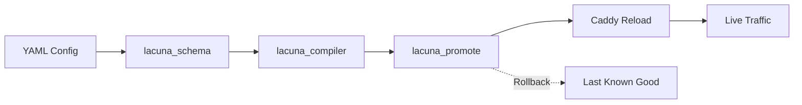

# Lacuna v2 - KISS Redirection Service

A **Keep It Simple, Stupid** redirection service powered by **Caddy** at the edge with static rules compiled from **YAML → Caddy JSON** using a minimal **Python** toolchain. No database. No runtime complexity. Just fast, deterministic redirects.

## Features

- **Exact and prefix redirects**: Simple pattern matching with deterministic rule ordering
- **HSTS support**: Per-host HTTP Strict Transport Security with granular control
- **Double-buffer promotion**: Safe config updates with graceful reload and instant rollback
- **Observability by default**: Automatic rule ID tracking, structured logging, and metrics-ready headers
- **External redirects allowed**: Support for redirecting to any `http` or `https` target
- **Deterministic builds**: Reproducible output with metadata tracking (timestamps, git hashes, checksums)
- **Fast failure**: Validates early, refuses dangerous configs, preserves last-known-good state

## Quick Start

### Prerequisites

- **Python** 3.12+ (3.13 recommended)
- **uv** (Python dependency manager) - [Install uv](https://docs.astral.sh/uv/)
- **Docker** or **Podman** (for running Caddy)

### Installation

```bash
# Clone the repository
git clone https://github.com/yourusername/Lacuna-ng.git
cd Lacuna-ng

# Install dependencies and pre-commit hooks
make install

# Or manually:
uv sync --all-extras --dev
uv run pre-commit install
```

### Development Workflow

```bash
# 1. Validate and compile example config (dry-run)
make compile

# 2. Run Caddy with compiled config
make run

# 3. Promote config with graceful reload (production-like)
make promote

# 4. Format code
make fmt

# 5. Run type checks
make lint

# 6. Run tests with coverage
make test

# 7. Clean build artifacts
make clean
```

## Project Structure

Lacuna v2 is organized as a **uv workspace** with multiple specialized packages:

```
Lacuna-ng/
├── packages/
│   ├── lacuna_schema/      # YAML validation and Pydantic models
│   ├── lacuna_compiler/    # YAML → Caddy JSON compiler
│   └── lacuna_promote/     # Double-buffer promotion with rollback
├── tools/
│   └── lacuna_sim/         # Dry-run simulator and dead rule detector
├── infra/
│   ├── Dockerfile.caddy    # Caddy container image
│   ├── compose.yaml        # Docker Compose for local dev
│   └── k8s/                # Kubernetes manifests
├── examples/
│   └── domainlist.yaml     # Sample redirect configuration
└── vol/                    # Local dev volumes (gitignored)
    ├── config/             # Config buffer (next/active/lastgood)
    └── caddy/              # Caddy data (ACME cache)
```

For detailed structure and dependency graph, see [PROJECT_STRUCTURE.md](PROJECT_STRUCTURE.md).

## Configuration Example

```yaml
version: 1
defaults:
  hsts: true
  keep_query: true

hosts:
  - host: example.com
    hsts: true
    rules:
      - id: home
        match: exact
        from: /
        to: https://www.example.org/
        status: 308
        keep_query: true

      - id: blog
        match: prefix
        from: /blog
        to: https://blog.example.org
        status: 308

  - host: parked.example.com
    hsts: false
    rules:
      - id: parked
        match: prefix
        from: /
        to: https://about.example.com/parked
        status: 302
```

## Architecture

Lacuna v2 follows a **simple, static, safe** design:

1. **Schema Validation** (`lacuna_schema`): YAML configs are validated against strict Pydantic v2 models
2. **Compilation** (`lacuna_compiler`): Validated configs are compiled to deterministic Caddy JSON
3. **Promotion** (`lacuna_promote`): Configs are double-buffered, validated, and gracefully reloaded
4. **Edge Serving** (Caddy): Battle-tested edge server handles HTTPS, ACME, and redirects



## Development

### For Contributors

This project uses AI agents for parallel development. See [AGENTS.md](AGENTS.md) for:
- Technical specifications and data contracts
- Detailed agent prompts for each sub-project
- Testing and validation requirements
- Security checklists and PR guidelines

### Tech Stack

- **Python**: 3.12+ with `mypy --strict` type checking
- **Dependency Manager**: uv (workspace mode)
- **Data Modeling**: Pydantic v2
- **CLI**: Typer or stdlib argparse
- **Testing**: pytest, coverage ≥85%, Hypothesis for property tests
- **Linting**: ruff, black
- **Containers**: Podman/Docker, multi-arch images to GHCR
- **Edge Server**: Caddy v2.8.x with JSON config

### Running Tests

```bash
# Run all tests with coverage
make test

# Run specific package tests
uv run pytest packages/lacuna_schema/tests/ -v

# Run with coverage report
uv run pytest --cov --cov-report=html
open htmlcov/index.html
```

### Pre-commit Hooks

Pre-commit hooks ensure code quality before commits:

```bash
# Install hooks (done automatically by `make install`)
uv run pre-commit install

# Run manually on all files
uv run pre-commit run --all-files
```

Hooks include:
- **ruff**: Fast linting and formatting
- **black**: Code formatting
- **mypy**: Strict type checking
- **yamllint**: YAML validation
- **Standard checks**: trailing whitespace, EOF fixer, merge conflicts

## Security

- **Scheme allowlist**: Only `http` and `https` targets allowed
- **No templating**: Refuses `{`, `}`, or `$` in redirect targets
- **No open redirects**: All targets are explicitly defined in config
- **Admin API security**: Caddy admin bound to loopback/internal network only
- **HSTS enforcement**: Per-host HSTS with `max-age=31536000; includeSubDomains; preload`
- **Safe promotion**: Double-buffered config with instant rollback on failure

## Observability

Every redirect response includes:
- **`X-Lacuna-Rule` header**: Identifies which rule matched
- **Structured logs**: JSON format with rule ID, host, path, status, latency
- **ACME monitoring**: Automatic certificate renewal with failure alerts
- **Reload tracking**: Logs all config promotions and rollbacks

## License

MIT or Apache 2.0 (to be determined)

## Status

**Current Phase**: Documentation and setup complete
**Next Steps**: Parallel development of core packages (schema, compiler, promote)

See [PROJECT_STRUCTURE.md](PROJECT_STRUCTURE.md) for the full development roadmap.
